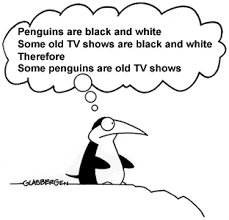

# Mathematical-Logic

This project was created as part of INTRODUCTION TO MATHEMATICAL LOGIC FOR PROGRAMMING-ORIENTED STUDENTS 2020 course @ Hebrew University of Jerusalem.

It is an implementation of mathematical logical formulae and logical proofs as Python objects. 
In other words, this projects contains methods and functions that deal with Python objects like Formula and Proof.
For example, propositions/semantics.py file contains a function called is_tautology(formula) which determines if the given logical formula is a yautology, i.e., logically always true.   

